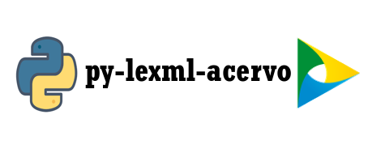

# py-lexml-acervo
<div style="vertical-align:middle;"></div>

`py-lexml-acervo` é um wrapper para a API de consulta do acervo do projeto [LexML](https://www12.senado.leg.br/dados-abertos/conjuntos?grupo=legislacao&portal=legislativo).

## 1. O que é o projeto LexML?

Trata-se de um portal especializado em informação jurídica e legislativa. Pretende-se reunir leis, decretos, acórdãos, súmulas, projetos de leis entre outros documentos das esferas federal, estadual e municipal dos Poderes Executivo, Legislativo e Judiciário de todo o Brasil: uma rede de informação legislativa e jurídica que pretende organizar, integrar e dar acesso às informações disponibilizadas nos diversos portais de órgãos do governo na Internet. <strong>@[Fonte](https://projeto.lexml.gov.br/documentacao/destaques-lexml#o-que-lexml)</strong>.

## 2. Acervo do Portal LexML

A API do LexML permite realizar pesquisas por meio de URLs e receber o resultado no formato XML. A API segue o padrão definido pelo Biblioteca do Congresso Norte-americano no projeto [Search/Retrieval via URL (SRU)](http://www.loc.gov/standards/sru/).

## 3. Dataset

Entre os dias 12 a 13 de agosto de 2019 por meio da presente API foram coletados os metadados do acervo do LexML de publicações datadas entre os anos de 1556 a 2019. O referido dataset está disponível na plataforma [Kaggle](https://www.kaggle.com/). Para acessá-lo basta clicar na imagem abaixo. O dataset possui aproximadamente <strong>2GB</strong> compactado, e descompacto em torno de <strong>10GB</strong>.

<div style="vertical-align:middle;"><a href="https://www.kaggle.com/lexmlacervo/lexml-brasil-acervo"></a></div>


## 4. Metadados de Retorno da API

- `<tipoDocumento>`
- `<facet-tipoDocumento>`
- `<date>`
- `<urn>`
- `<localidade>`
- `<facet-localidade>`
- `<autoridade>`
- `<facet-autoridade>`
- `<title>`
- `<description>`
- `<subject>`
- `<type>`
- `<identifier>`

### 4.1 Exemplo de retorna da API
```xml
<srw:recordData>
        <srw_dc:dc xsi:schemaLocation="info:srw/schema/1/dc-schema http://www.loc.gov/z3950/agency/zing/srw/dc-schema.xsd">
          <tipoDocumento>Lei</tipoDocumento>
          <facet-tipoDocumento>Legislação::Lei</facet-tipoDocumento>
          <dc:date>1983-12-05</dc:date>
          <urn>urn:lex:br;rondonia:estadual:lei:1983-12-05;12</urn>
          <localidade>Rondônia</localidade>
          <facet-localidade>Estados::Rondônia</facet-localidade>
          <autoridade>Estadual</autoridade>
          <facet-autoridade>Estadual</facet-autoridade>
          <dc:title>Lei ordinária nº 12,  de 05 de Dezembro de 1983</dc:title>
          <dc:description>ABRE CRÉDITO SUPLEMENTAR NO ORÇAMENTO VIGENTE.</dc:description>
          <dc:subject>CRÉDITO SUPLEMENTAR</dc:subject>
          <dc:type>html</dc:type>
          <dc:identifier>000349953</dc:identifier>
        </srw_dc:dc>
</srw:recordData>
```

## 5. Instalação da biblioteca py-lexml-acervo
### 5.1 Clona Repositório
`git clone https://github.com/netoferraz/py-lexml-acervo.git`<br>
### 5.2 Acessa o repositório clonado
`cd py-lexml-acervo`
### 5.3 Cria um ambiente virtual
#### 5.3.1 virtualenv
`python -m venv .venv`
### 5.4 Ativa o ambiente virtual
`source ./.venv/bin/activate`
### 5.5 Instala as dependências
`pip install -r requirements.txt`

## 6. Instruções de uso
As consultas à API se baseiam na <strong>classe</strong> `LexmlAcervo` localizada em `./apis/acervo`. Para realizar uma consulta se deve instanciar a referida <strong>classe</strong> passando como parâmetro de inicialização uma `query string` no padrão [CQL](https://www.loc.gov/standards/sru/cql/spec.html).

```python
#exemplo de inicialização
consulta_acervo_2019 = LexmlAcervo("date=2019")
```
A efetiva consulta à API ocorre pela chamada de um dos métodos a seguir: `query` ou `automatic_pagination`. O primeiro é um chamado manual à API passando os parâmetros `startRecord` e `maximumRecordsPerPage` que são respectivamente: a posição de início no set de resultados retornado pela API gerado pela `query_string`, enquanto o segundo faz uso dos mesmos parâmetros realizando um esgotamento da resposta associada a `query_string`. Portanto, ao se utilizar o método `automatic_pagination` ele fará a paginação automática de todo o resultado associado à consulta.


## 6.1 Consulta Manual
```python
#consulta qualquer urn que contenha a palavra decreto
#e que seja de um documento associado ao ano de 2018
urn_decreto_2018 = LexmlAcervo("urn any decreto and date any 2018")
#faz a chamada a API iniciando no primeiro resultado
#e solicita 100 resultados por paginação
tree, start_record_next_query, maximumRecordsPerPage = urn_decreto_2018.query(startRecord=1, maximumRecordsPerPage=100)
```

## 6.2 Paginação Automática
```python
#consulta qualquer urn que contenha a palavra decreto
#e que seja de um documento associado ao ano de 2018
urn_decreto_2018 = LexmlAcervo("urn any decreto and date any 2018")
#O método automatic_pagination faz uma chamada recursiva
#atualizando o parâmetro startRecord até o esgotamento da resposta.
urn_decreto_2018.automatic_pagination(startRecord=1, maximumRecordsPerPage=100)
```

## 6.3 Salvar resultados em XML
Cada página do set de resultados da `query string` será armazenado em um arquivo `XML` distinto. Para
realizar a persistência dos resultados deve-se invocar o método `saveResults` da **instância** da classe `LexmlAcervo`. O referido método possui dois parâmetros obrigatórios: `path` e `filename`. O primeiro é o diretório onde se deseja salvar os arquivos e o segundo é o nome base dos arquivos.
```python
urn_decreto_2018.saveResults("./data/xml/decreto/2018", "2018")
```

## 6.4 Conversão de arquivos XML em JSON
A classe `XmlToJson` oferece uma interface para converter os arquivos XML em JSON.
```python
year = 2018
#listar os arquivos XML
xmlpath = Path(f"./data/xml/decreto/{year}").glob("*.xml")
#transforma os arquivos XML em JSON
jsonFiles = [XmlToJson(xmlfile).parseToJson() for xmlfile in xmlpath]
#persiste os arquivos em disco.
XmlToJson.saveResults(jsonFiles, f"./data/json/{year}", f"{year}")
```